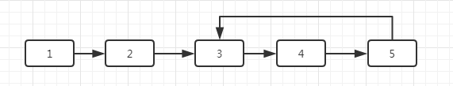

# 链表中环的入口节点

> 如果一个链表中包含环，如何找出环的入口节点

例: 
这里环的入口为3

解题思路

1. 首先确定链表存在环

可以定义两个指针，都指向链表头。第一个以1的步速向尾部移，第二个以2的步速向尾部移。如果两个在A节点相遇，则说明存在环。

确定存在环后，假设环的长度为n。在定义两个指针后，第一个指向头部，第二个指向距离第一个节点的节点。两个节点在以相同的速度移动。当两个节点相遇时，相遇的节点就是环的入口节点

2. 现在问题转化为求环的长度。

第1步中，两个指针相遇点A， 继续以1的步速移动，再回到A节点时，移动的距离就是环的长度。

