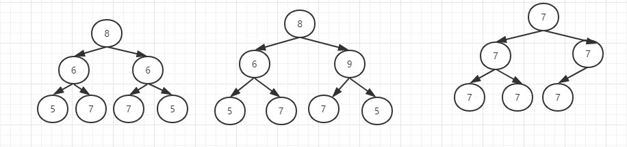

# 对称二叉树

> 请实现一个函数，用来判断一颗二叉树是不是对称的。如果一个二叉树和它的镜像一样，那么他是对称的。

如图，第一颗是对称的。而另外两颗则不是。

分析： 二叉树有三种遍历算法，前序，中序，后序，这三种都是先左节点在有节点。现在我们定义一种先右节点在左节点的遍历方法。

前序遍历第一颗树         {8, 6, 5, 7, 6, 7, 5}
采用我们自己定义的前序遍历{8, 6, 5, 7, 6, 7, 5}

发现两者是一样的。

遍历第二颗树

前序遍历第一颗树         {8, 6, 5, 7, 9, 7, 5}
采用我们自己定义的前序遍历{8, 9, 5, 7, 6, 7, 5}

遍历第三棵树

发现都是 {7, 7, 7, 7, 7, 7}

这样就没办法判断了。因此把空指针也考虑进去结果如下:

前序遍历第一颗树         {7, 7, 7, null, null, 7, null, null, 7, 7, null, null, null}
采用我们自己定义的前序遍历{7, 7, null, 7, null. null, 7, 7, null, null, 7, null, null}