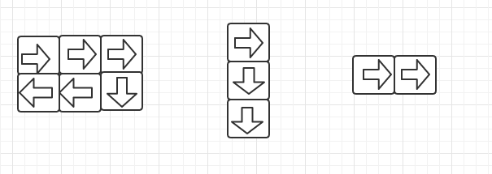

# 顺时针打印矩阵

> 输入一个矩阵，按照从外向里以逆时针的顺序依次打印出每一个数字，例如输入如下矩阵:

```
1   2   3   4
5   6   7   8
9   10  11  12
13  14  15  16
```

则依次打印出数字:1,2,3,4,8,12,16,15,14,13,9,5,6,7,11,10

思路: 主要是多画几个矩阵分析，寻找规律

矩阵二

```
1  2  3  4  5
6  7  8  9  10
12 11 12 13 14
```

矩阵3

```
1  2  3 
6  7  8 
12 11 13
4  5  9
```

可以发现

1. 可以发现第一圈遍历是以(0,0)为起点，第二圈遍历是以(1,1)为起点.每一圈的起始坐标都是(start, start)

2. 对于一个rows行，columns列的矩阵，循环继续的条件是 columns > startX * 2 且 rows > startY * 2。

3. 打印一圈有四步，从左到右打印一行，从上到下打印一行，从右到左打印一行，从下到上打印一行。最后一圈需要注意下，最后一圈可能只有一行，只有一列，甚至只有一个数字，因此打印最后一圈可能不需要四部。

    最后一圈各种情况
    

4. 最后一圈，第一步总是需要的，如果只有一行，那就只需要第一步，需要第二步最后一圈至少两行，需要第三步最后一圈至少两行两列。需要第四不至少三行两列
