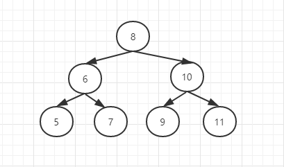

# 二叉搜索树的后序遍历序列

> 输入一个整数数组，判断该数组是不是某个二叉搜索树的后序遍历结果。如果是则返回true，否则返回false。假设输入的数组任意两个数字都是不相同的
> 例如输入数组{5, 7, 6, 9, 11, 10, 8}则返回true，它是下面二叉搜索树的后续遍历的结果

分析:

后续遍历序列特点

- 最后一个数字是树的根节点值。
- 数组中前面的数字可以分成两部分：第一部分是左子树节点的值，它们都比根节点的值小。第二部分是右子树的值，它们都比根节点的值大。

以数组{5, 7, 6, 9, 11, 10, 8}为例子， 8是根节点的值。在这个数组中，5, 7, 6的值都比8小。是8这个节点的左子树。9，11，10都比8这个节点值大，是节点8的右子树。

然后以同样的方法确定数组中每一部分的子树结构。对于序列{5,7,6}。6为根的值。5为左子树，7为右子树。