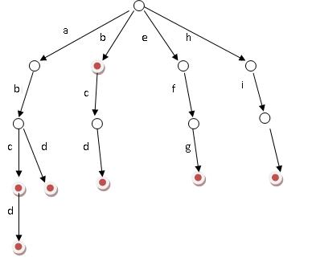

# Trie树（字典树）

Trie树，即字典树，又称单词查找树或键树，是一种树形结构。它有3个基本性质：

- 根节点不包含字符，除根节点外每一个节点都只包含一个字符。
- 从根节点到某一节点，路径上经过的字符连接起来，为该节点对应的字符串。
- 每个节点的所有子节点包含的字符都不相同。

即如果现在有b，abc，abd，bcd，abcd，efg，hii 这6个单词，我们可以构建一棵如下图所示的树：



上图中红色的节点为终止节点， 表示从根节点到这个节点的路径，是一个存在的字符串

定义一下字典树的结构：

```golang
type trie_node struct {
	count int  // 以个节点为终点的字符串数量
	pass int // 所有路过这个节点字符串的数量
	next [trie_widths]*trie_node // 子节点，列表索引为字符串在unicode中的码点。我们这里只考虑英文字符
}
```

## 操作

### 插入字符串
1、从头到尾遍历字符串的每一个字符
2、从根节点开始插入，若该字符存在，那就不用插入新节点，要是不存在，则插入新节点
3、然后顺着插入的节点一直按照上述方法插入剩余的节点
4、为了统计每一个字符串出现的次数，应该在最后一个节点插入后count加一，表示这个字符串出现的次数增加一次

```golang
// 字典树插入
func (t *trie) Insert(str string) {
	rune_str := []rune(str)

	cur := t.root
	for _, v := range rune_str {
		if cur.next[v] == nil {
            // 当前字符从未出现过， 创建这个字符的节点
			newNode := &trie_node{
				count: 0,
				pass: 0,
				next: [trie_widths]*trie_node{},	
			}

			cur.next[v] = newNode
		}
		cur = cur.next[v]
		cur.pass++ // 每个字符串经过一次都要加一
	}
	cur.count++  // 以这个节点终止，count加一
}
```

### 删除一个字符串

1. 判断是否存在
2. 经历过的节点pass减一， 终止节点count建议
3. pass和count都为0的节点，删除掉

```golang
	if !t.Search(str) {
		return 
	}
	rune_str := []rune(str)

	cur := t.root
	for _, v := range rune_str {
		cur.pass--
		cur = cur.next[v]
		if cur.count == 0 && cur.pass == 0 {
			cur = nil
		}
	}
	cur.count--

	if cur.count == 0 && cur.pass == 0 {
		cur = nil
	}
```

###是否存在某个字符串
1、查询字符串是从第一个字符开始的
2、如果查询的位置刚好为字符串的长度，这时，判断这个节点是否为终止节点(count>0)

```golang

func (t *trie) Search(str string) bool {
	rune_str := []rune(str)

	cur := t.root
	for _, v := range rune_str {
		cur.pass++
		if cur.next[v] == nil {
			return false
		}
		cur = cur.next[v]
	}

	if cur.count == 0 {
		return false
	}

	return true
}
```

## 应用

1. 前缀匹配, trie树前缀匹配常用于搜索提示。如当输入一个网址，可以自动搜索出可能的选择。当没有完全匹配的搜索结果，可以返回前缀最相似的可能

2. http server 路由匹配, 根据url查找对应url的处理器，常见与web框架中

## ref

[https://zh.wikipedia.org/wiki/Trie](https://zh.wikipedia.org/wiki/Trie)
[https://github.com/julycoding/The-Art-Of-Programming-By-July/blob/master/ebook/zh/06.09.md](https://github.com/julycoding/The-Art-Of-Programming-By-July/blob/master/ebook/zh/06.09.md)
